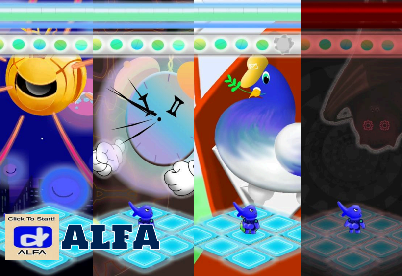
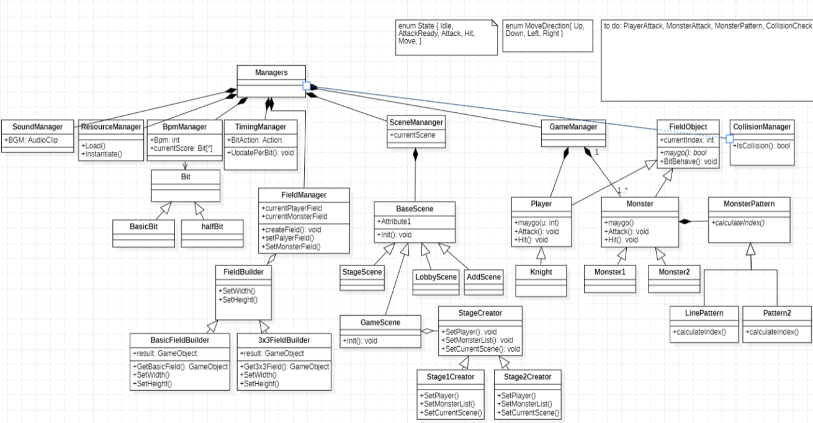
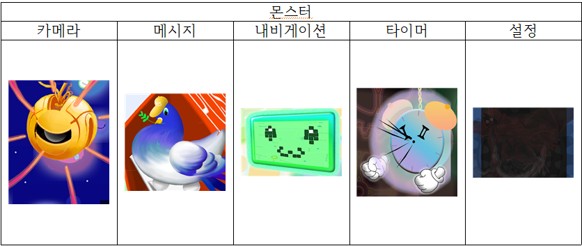
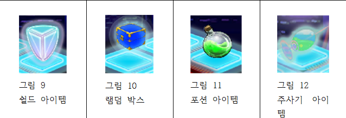

# AlarmFighter

**모바일 2D 리듬 캐주얼 게임 개발 프로젝트**

## 🔍 프로젝트 개요

- **프로젝트명**: AlarmFighter
- **개발 기간**: 2022.12 ~ 2023.03 (총 3개월)
- **사용 엔진**: Unity
- **개발 언어**: C#
- **참여 인원**: 총 5명 (개발 4명, 아트 1명)
- **관련 링크**: [Youtube](https://youtu.be/VHMg_UpHVT0)

## 🎮 게임 소개

AlarmFighter는 바이러스에 감염된 앱을 정화한다는 세계관을 기반으로 한 하이퍼 캐주얼 2D 리듬 게임입니다. 기존 리듬게임의 방식에서 벗어나 **타일을 밟아 회피/공격을 수행하는 새로운 게임플레이**를 구현했습니다.

---

## 🛠 주요 기능 및 개발 내용

### 📌 Game Flow 설계
- 메인 → 스테이지 선택 → 인게임으로 구성
- 유저가 백신 프로그램을 실행하여 앱을 스캔하는 콘셉트로, 스테이지는 감염된 앱으로 표현
- 하이퍼 캐주얼 구조에 맞춘 짧고 반복 가능한 진행

### 📌 클래스 다이어그램

- 퍼사드 패턴(Facade Pattern)을 활용해 Manager 계층으로 모든 시스템 접근을 일원화
- 박자 기반 리듬 처리 기능: BPM Manager, Timing Manager 설계 및 구현
- Object Pooling 기법을 활용하여 메모리 최적화 및 CG 부하 방지

### 📌 몬스터 & 패턴 설계

- "바이러스에 감염된 앱"이라는 설정에 따라 앱 아이콘을 변형한 몬스터 디자인
- 몬스터 FSM 설계 및 RPM에 맞는 공격 패턴 구현
- 레이저/추수기/플래시 등 다양한 공격 방식 구현
- 플레이어 반응 기반 로직 적용

### 📌 아이템 시스템

- 타일 위 생성 아이템을 통한 회복, 방어, 공격 등 기능
- 타일에서 획득 가능한 아이템들로 다양한 효과 구현:
    - 실드 아이템: 데미지 방어
    - 랜덤 박스: 다양한 효과 발동
    - 포션: 체력 회복
    - 주사기: 공격력 강화
 - 게임 중 생성되는 아이템은 타일 위에 배치되며, 캐릭터가 해당 위치로 이동 시 자동 획득
 - 회복, 강화, 랜덤 효과 등을 통해 게임 전략에 다양성 추가
---

## 🔍 문제 해결 사례

### 🔁 기획 변경 반복
- 기존에 없던 플레이 방식으로 인해 지속적인 논의 필요
- 해결: 정기/비정기 기획 회의를 통해 의사결정 명확화

### 🎨 디자이너와의 협업 이슈
- 실사 스타일 vs 캐주얼 스타일 충돌
- 해결: 최종 콘셉트 확정 전까지 기획 및 아트 간 조율 반복

---

## 🏆 성과

- **캐주얼 모바일 리듬 게임 제작 완수**
- **인디크래프트 공모전 참가**
- **경기게임오디션 공모전 참가**

